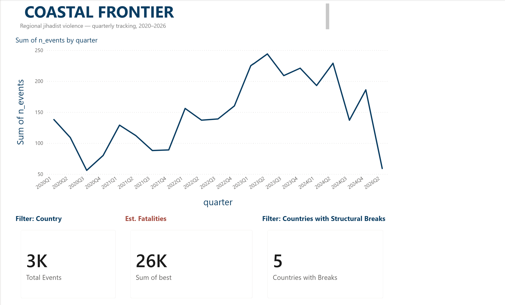
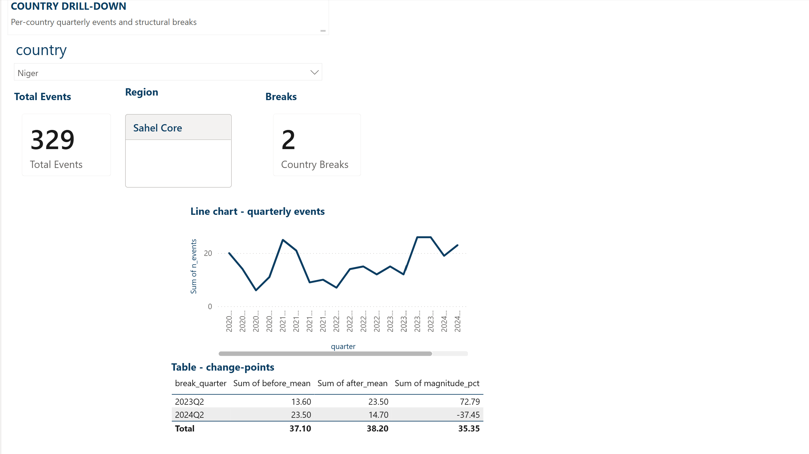
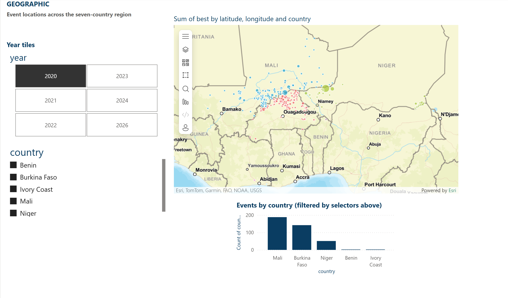
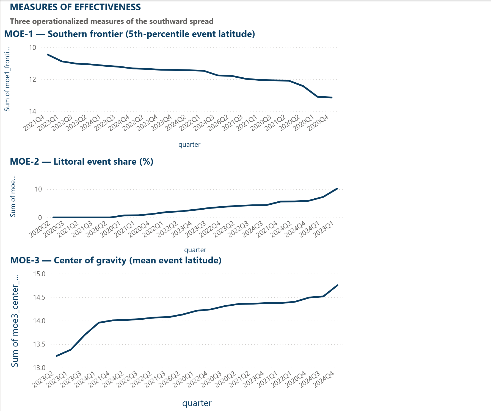

# Coastal Frontier

**Measuring the southward spread of Sahel violence into littoral West Africa, 2020–2026.**

> **Headline finding:** Across three independent measures, jihadist violence has spread southward from the Sahel core into the littoral states — but the pattern is **extension, not shift**. The Sahel core has not relocated; it has radiated outward while remaining active in its original epicenters. The southern frontier advanced ~145 km over the analysis window; the littoral share of regional events roughly tripled; the center of gravity barely moved. The 6.5× disparity between frontier-speed and bulk-speed is the operational finding.
>
> Change-point detection adds the *when*: three statistically significant regional inflections — **2021Q4, 2022Q4, and 2024Q2** — align with the Burkina Faso coup wave, the post-Barkhane transition, and AES consolidation. Since mid-2024 the Sahel-core states show retreat while **Benin alone continues to escalate** — and the disproportionate Burkina Faso drop (–55%) versus Mali (–15%) suggests post-coup reporting suppression contributes to the apparent de-escalation.

**📄 [Read the 4-page analytical brief (PDF)](reports/coastal_frontier_brief.pdf)** — PMESII-PT structure, BLUF, three MOEs with rejection criteria, methodology, recommendations.

**📊 Power BI dashboard** — [`reports/coastal_frontier_dashboard.pbix`](reports/coastal_frontier_dashboard.pbix) (open in Power BI Desktop to interact), or browse the static page exports:

| | |
|---|---|
|  |  |
|  |  |

---

## Why this exists

After the wave of Sahel coups between 2020 and 2023 — Mali twice, Burkina Faso twice, Niger once — and the withdrawal of French (Barkhane, Sabre) and EU missions that followed, I kept reading headlines about "spillover" into coastal West Africa. But nobody seemed to be showing me at what *speed*, in what *direction*, or with what *warning signs*. The Sahel-to-coast frontier became the question I couldn't put down.

This repo is my attempt to answer that question from open data — honestly, including where the data refuses to tell the story I expected.

## The hypothesis and the result

**H1:** Since 2020, jihadist violence has spread southward from the Sahel core (Mali / Burkina Faso / Niger) into the northern littoral states (Togo, Benin, Côte d'Ivoire, Ghana) at an accelerating rate.

H1 was tested against three *pre-declared* measures with rejection criteria stated **before** the data was loaded:

| Measure | Definition | Result | Verdict |
|---|---|---|---|
| **M1 — Southern frontier** | 5th-percentile latitude of events per quarter | -0.215°/yr (~145 km south) | ✓ supports H1 |
| **M2 — Littoral share** | Share of events in Togo / Benin / Côte d'Ivoire / Ghana per quarter | +0.79 pp/yr (~2% → ~7%) | ✓ supports H1 |
| **M3 — Center of gravity** | Mean latitude of events per quarter | -0.032°/yr (~22 km south) | ✓ supports H1 (weakly) |

All three measures move in the predicted direction with positive pairwise correlations (M1↔M2 r=0.70, M1↔M3 r=0.49, M2↔M3 r=0.44).

**The disparity is the story.** M1 (frontier) outpaces M3 (bulk) by 6.5×. The frontier raced south while the bulk barely moved. This is the signature of *extension* — operations radiating outward without abandoning the core — not *relocation*. Planners should treat the Sahel-core violence and the new littoral activity as additive phenomena, not substitutive ones.

**The timing, from change-point detection (R, BinSeg with top-N constraint):**

| Series | Structural breaks | Segment means (events/quarter) |
|---|---|---|
| Regional | 2021Q4, 2022Q4, 2024Q2 | 100 → 148 → 220 → 127 |
| Burkina Faso | 2022Q4, 2023Q4 | 41 → 124 → 56 |
| Mali | 2021Q4, 2024Q2 | 47 → 80 → 68 |
| Niger | 2023Q2, 2024Q2 | 14 → 24 → 15 |
| Benin | 2022Q4, 2023Q4 | 2.2 → 4.5 → **6.8 (still rising)** |
| Togo | 2022Q4, 2023Q1 | 2.3 → 13 → 2.9 |

The per-country pattern reveals two opposite trajectories operating simultaneously: Sahel-core countries peak-then-retreat, while Benin escalates monotonically with no retreat. The geographic spillover corridor is the Burkina / Togo / Benin tri-border zone (~1°E, 11°N) — roughly two-thirds of all littoral events cluster there. Côte d'Ivoire shows effectively no UCDP-recorded spillover (1 event in six years).

## Methodology in 30 seconds

1. Ingest UCDP GED + UCDP Candidate event data, 2020–2026, seven countries (Sahel core + littoral neighbors).
2. Apply pre-declared inclusion rules: `where_prec ≤ 4`, `date_prec ≤ 3`, `code_status == "Clear"`. All rules live as module-level constants in `src/coastal_frontier/ucdp.py`.
3. Aggregate to quarterly time series for each of three operationalizations of "southward spread."
4. Z-score, flip signs to a common direction, plot together, compute pairwise correlations.
5. Detect structural breaks with R's `changepoint` package (Binary Segmentation, Q=3 regional / Q=2 per country; PELT/MBIC over-fit the 21-quarter series and was rejected — see `scripts/changepoint_analysis.R`).
6. Overlay external context (coups, withdrawals, Wagner / Africa Corps deployment) against detected inflection points.
7. Publish brief in PMESII-PT framework structure with declared MOEs, and a Power BI dashboard for interactive exploration.

Full reasoning lives in `notebooks/02_hypothesis.ipynb` and `notebooks/03_geography.ipynb`.

## Data sources

**Primary — UCDP Georeferenced Event Dataset.** Versions 25.1 (stable, 1989–2024) + 26.0.4 (Candidate, 2025+). Free, peer-reviewed, downloadable from [ucdp.uu.se/downloads](https://ucdp.uu.se/downloads/). Event-level conflict data with village-level geocoding, day-level dates, full actor and dyad attribution. UCDP's 25-deaths-per-year inclusion threshold acts as a noise filter — only organized armed conflict appears, not protests or street crime.

**Secondary (kept as fallback) — ACLED via OAuth password grant.** The OAuth client at `src/coastal_frontier/acled.py` is fully functional. Access to ACLED's free API tier was denied for this project (`403 Access denied` on `/api/acled/read`), so the project pivoted to UCDP. The ACLED integration code is committed and would activate immediately on approval — `smoke_test()` works end-to-end as written.

## Repository layout

```
coastal-frontier/
├── data/
│   ├── raw/         untouched UCDP CSVs (gitignored, regenerable from source)
│   ├── interim/     filtered Parquet + quarterly counts (per the inclusion-rule contract)
│   └── processed/   analysis-ready outputs
├── notebooks/
│   ├── 01_exploration.ipynb   first-pass EDA
│   ├── 02_hypothesis.ipynb    three measures of southward spread
│   └── 03_geography.ipynb     five maps of the spatial story
├── scripts/
│   ├── prepare_changepoint_input.py   quarterly counts for R
│   ├── changepoint_analysis.R         BinSeg structural-break detection
│   ├── build_brief.py                 markdown -> PDF via pandoc + wkhtmltopdf
│   └── export_for_powerbi.py          five analytic CSVs for the dashboard
├── src/
│   └── coastal_frontier/
│       ├── config.py    paths + OAuth credentials, fail-fast validation
│       ├── acled.py     ACLED OAuth client (fallback, ready when access granted)
│       └── ucdp.py      UCDP GED loader with declared inclusion rules
├── reports/
│   ├── coastal_frontier_brief.md / .pdf   the 4-page PMESII-PT brief + source
│   ├── coastal_frontier_dashboard.pbix    Power BI dashboard (4 pages)
│   ├── changepoint_summary.txt            R structural-break results
│   ├── data_for_powerbi/                  dashboard data tables
│   └── figures/                           charts, change-point plots, dashboard exports
├── sql/                 SQL queries (versioned as code)
├── .env.example         template for required credentials
└── requirements.txt     pinned Python dependencies
```

## Reproducing this on your machine

```bash
git clone git@github.com:nogpaul/coastal-frontier.git
cd coastal-frontier

python -m venv .venv
.\.venv\Scripts\Activate.ps1     # Windows PowerShell
# source .venv/bin/activate      # macOS / Linux

pip install -r requirements.txt
```

Download UCDP data and place CSVs into `data/raw/`:

1. Visit [ucdp.uu.se/downloads](https://ucdp.uu.se/downloads/)
2. Download **GED Global version 25.1** as CSV
3. Download **UCDP Candidate Events Dataset** latest version as CSV
4. Move both CSVs into `data/raw/` (filenames will be `GEDEvent_v25_1.csv` and `GEDEvent_v26_0_X.csv`)

Run the ingest, then the analysis chain:

```bash
python -c "from src.coastal_frontier.ucdp import run; run()"
python scripts/prepare_changepoint_input.py
Rscript scripts/changepoint_analysis.R        # requires R + changepoint, dplyr, ggplot2, readr
python scripts/export_for_powerbi.py
python scripts/build_brief.py                 # requires pandoc + wkhtmltopdf
```

Then open the notebooks in Jupyter Lab, or `reports/coastal_frontier_dashboard.pbix` in Power BI Desktop.

The `.env.example` documents optional credentials for the ACLED fallback path. Not required for the UCDP pipeline.

## Tools used

Python (pandas, numpy, geopandas, matplotlib, seaborn), R (`changepoint` — structural-break detection), SQL-style aggregation via pandas, QGIS (spatial verification), Power BI Desktop (4-page interactive dashboard), pandoc + wkhtmltopdf (reproducible PDF brief).

## Known limitations

These shape every interpretation and live here so they're never out of sight:

- **UCDP inclusion threshold.** UCDP only records events linked to dyads that crossed 25 battle-related deaths in some year. Early-stage spillover into littoral states (small-scale incursions, isolated incidents) is under-captured until the threshold is crossed. **The M2 (littoral share) trend is therefore a lower bound** — the real southward push is likely steeper than +0.79 pp/yr.
- **Post-coup reporting suppression.** Burkina Faso (since 2022) and Niger (since 2023) restricted media operations after their respective coups. Recent Sahel-core event counts are likely *under*-stated. The disproportionate post-2024 retreat (Burkina –55% vs Mali –15%) correlates inversely with press freedom across the three states — suggesting a meaningful share of the apparent de-escalation is reporting artifact. The extension finding is consistent with reporting bias *and* with genuine extension; the two are not separable from this data alone.
- **PELT/MBIC over-fit warning.** The textbook change-point default (PELT + MBIC penalty) returned 18 breaks in 21 quarters — statistically meaningless on a short, high-variance series. The committed analysis uses Binary Segmentation with a top-N constraint instead; the methodological reasoning is documented in the brief and the script header.
- **2026 data is preliminary.** UCDP's Candidate dataset is actively under review; ~48% of 2025+ events failed the `code_status == "Clear"` filter and were excluded. The 2026 sub-window in any chart should be read as a lower bound.
- **2025 coverage gap.** The data jumps from 2024 to 2026 in our filtered view; UCDP's versioning of the Candidate dataset appears to skip 2025 in the v26.0.4 release.
- **ACLED unavailable.** This analysis uses only UCDP. A parallel ACLED analysis would catch lower-threshold events and likely show *stronger* extension signals, particularly in the littoral. The OAuth integration is ready for the day API access is granted.
- **Source-language bias.** UCDP reads many languages but under-captures Bambara, Hausa, and Fulfulde radio reporting — exactly the languages of the Sahel-coast borderlands.

## Status

Complete through v1. Full analytical chain shipped: ingest → EDA → hypothesis testing → geographic analysis → structural-break detection → PMESII-PT brief → Power BI dashboard. Re-run planned quarterly as UCDP releases new data.

## Questions I'm still chewing on

- **Is the 2024+ Sahel-core retreat real?** Cross-validating against ACLED (pending access), Africa Center for Strategic Studies tallies, or partner-nation reporting is the single highest-value next step. The press-freedom correlation is suggestive, not conclusive.
- **Why is Benin different?** It's the only country escalating through every detected regime. Geography (longest exposed border with Burkina), the W-Arly-Pendjari park complex as a sanctuary, or state-capacity differences with Togo — each predicts different futures.
- **Where is 2025 in the data?** UCDP's release cycle appears to skip the year in v26.0.4. Investigation pending.
- **Would ACLED change the verdict?** ACLED's lower inclusion threshold should catch early-stage incidents UCDP misses. The directional finding (extension) should hold; the magnitude on M2 likely grows.
- **Could a same-methodology analysis on the Lake Chad Basin (Nigeria, Cameroon, Niger, Chad) serve as a control region?** Same data source, comparable conflict ecosystem — would tell us whether extension-not-shift is general to Sahel-style insurgencies or specific to the West African case.

## License

MIT — do what you want, attribution appreciated.
